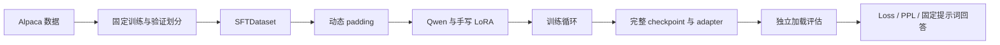
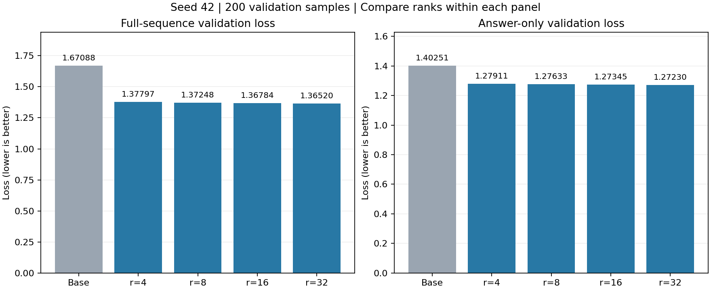
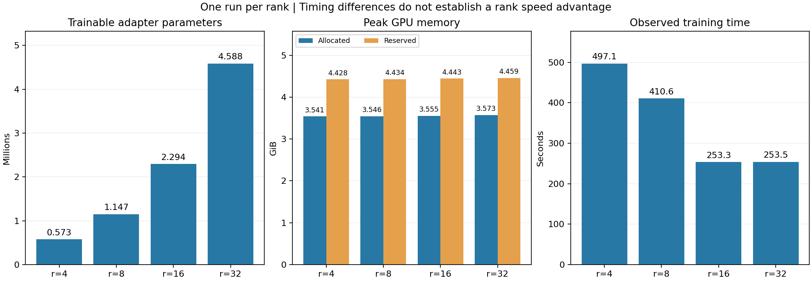

# Mini-LLM-Trainer

基于 PyTorch 的轻量级 LLM SFT 训练与手写 LoRA 实验项目。
使用 Hugging Face 提供的 `Qwen/Qwen3-0.6B-Base` 模型实现；项目实现数据处理、
训练循环、checkpoint、评估和 LoRA，不包含从零实现基础 Transformer 或预训练大模型。

## 已实现

- Alpaca 格式 Dataset、动态 padding、causal LM labels 和可选 answer-only 评估。
- AdamW、梯度累积、梯度裁剪、线性 warmup/decay、CUDA bf16 autocast。
- 完整 checkpoint 保存/恢复，以及独立 LoRA adapter 保存/加载。
- 手写 LoRA 和注入；小型 CPU 模型的前向、梯度、单次更新与 PEFT 对齐；
  真实 Qwen 的固定提示词末 token logits 对齐。
- r=4/8/16/32 的单 seed 对照实验，全序列与 answer-only 两种验证口径。
- 训练 JSON 配置、配置校验和评估命令行参数。



## 环境与安装

2026-09-21 核对的本地环境：Windows、Python 3.13.2、PyTorch 2.10.0+cu126、
NVIDIA GeForce RTX 4060 Laptop GPU，CUDA 和 bf16 可用。
主要 Python 依赖见 [requirements.txt](requirements.txt)。它固定项目所需包的版本，
不是包含所有间接依赖的完整锁文件。

以下命令均在项目根目录的 PowerShell 执行。已有可用 `.venv` 时无需重新创建。
新环境先安装 Python 3.13，再执行：

```powershell
py -3.13 -m venv .venv
.\.venv\Scripts\python.exe -m pip install --upgrade pip
.\.venv\Scripts\python.exe -m pip install torch==2.10.0 --index-url https://download.pytorch.org/whl/cu126
.\.venv\Scripts\python.exe -m pip install -r requirements.txt
.\.venv\Scripts\python.exe -m pip check
```

CUDA wheel 地址依据 [PyTorch 官方历史版本安装说明](https://pytorch.org/get-started/previous-versions/#v2100)。
项目无需安装 torchvision 或 torchaudio。先选择 CUDA wheel，再安装其余依赖；
清单中的 `torch==2.10.0` 接受已安装的 `2.10.0+cu126`。

确认解释器和 GPU：

```powershell
.\.venv\Scripts\python.exe -c "import sys, torch; print(sys.executable); print(torch.__version__); print('CUDA:', torch.cuda.is_available()); print('bf16:', torch.cuda.is_bf16_supported() if torch.cuda.is_available() else False)"
```

真实模型实验使用上述 CUDA/bf16 环境；CPU 可用于小型单元测试，未验证 CPU 上完整模型训练。
当前开发环境额外装有项目不使用的类型提示包：`pip check` 报告 `pandas-stubs`
缺少 `types-pytz`、`scipy-stubs` 缺少 `optype`。它们未列入项目依赖；当前环境
不能据此宣称整体依赖检查全通过。本次未重新安装环境或执行全新环境复现。

## 数据与模型缓存

首次下载需要能够访问 Hugging Face。数据源为
[`yahma/alpaca-cleaned`](https://huggingface.co/datasets/yahma/alpaca-cleaned)，
模型为 [`Qwen/Qwen3-0.6B-Base`](https://huggingface.co/Qwen/Qwen3-0.6B-Base)。

```powershell
.\.venv\Scripts\python.exe prepare_data.py
.\.venv\Scripts\python.exe -c "from huggingface_hub import snapshot_download; snapshot_download(repo_id='Qwen/Qwen3-0.6B-Base', cache_dir='model')"
```

数据保存在 `data/alpaca_seed42_train2000_val200`：打乱 seed=42，前 200 条验证，
接下来的 2000 条训练。脚本检查样本 ID 不重叠、顺序可重复和落盘内容一致；
已有目录会检查内容，不会直接覆盖。

`smoke_train.py` 使用 `local_files_only=True`，必须先准备模型和 tokenizer 缓存。
模型缓存和训练产物不随代码分发。当前下载入口没有固定远端 revision，
严格复现实验还需保存模型/数据 revision 与数据划分清单；仅固定 seed 不够。

## 配置检查与小规模运行

初始配置见 [configs/lora_r8.json](configs/lora_r8.json)。JSON 内相对路径以
项目根目录为基准；命令行的 `--config`、`--adapter` 相对路径以当前工作目录为基准。

```powershell
.\.venv\Scripts\python.exe train.py --help
.\.venv\Scripts\python.exe smoke_train.py --help
.\.venv\Scripts\python.exe evaluate.py --help
.\.venv\Scripts\python.exe -c "from src.utils import load_json_config, validate_train_config; c = load_json_config('configs/lora_r8.json'); validate_train_config(c); print('config valid')"
.\.venv\Scripts\python.exe -m pytest tests -q
```

以上帮助和配置检查不会启动训练。准备好缓存后，手动执行小规模检查：

```powershell
.\.venv\Scripts\python.exe -u smoke_train.py --config configs/lora_r8.json
```

它选择 16 条长度为 512 的样本，运行 2 次优化器更新，检查参数变化与显存，
不写 checkpoint。目前专用于 2000 条训练数据、batch=1、累积=8、长度=512、
完整调度 250 updates / 25 warmup 的基线；`resume_path` 必须为 `null`。
这项检查验证训练机制，不衡量微调质量。

## 训练与恢复

完整训练由使用者手动启动：

```powershell
.\.venv\Scripts\python.exe -u train.py --config configs/lora_r8.json
```

配置使用 r=8、alpha=16、q/v 投影、1 epoch、lr=1e-4、batch=1、累积=8。
输出到 `checkpoint/lora_r8_seed42_config_v1`，区别于历史实验的 baseline_v1 目录。
新训练拒绝已存在的输出目录；重跑需在配置中选择新的目录。

产物包括 `config.json`、`metrics.json`、`epoch_1.pt` 和 `adapter_epoch_1.pt`。
实际参数量、调度步数、设备及其他运行信息保存在有效配置中。计时只覆盖训练，
不包含模型加载、验证和 checkpoint 序列化。

恢复时，在单独的配置副本中填写 `resume_path`，指向完整的 `epoch_N.pt`，再通过
`train.py --config` 启动。保持模型、LoRA、优化器及原先计划的完整调度配置匹配；
`num_epochs` 表示计划的总 epoch 数，必须还有未完成的 epoch 才有后续训练。
恢复输出写入配置的 `checkpoint_dir/resumed/`，再次恢复前选择不会覆盖既有产物的目录。
adapter 文件不含优化器/调度器状态，不能用作训练恢复文件。
当前按已完成 epoch 恢复，未保存完整 RNG/DataLoader 状态，不保证任意随机运行逐位一致。

## 评估

完成上述训练后，对新 adapter 分别执行：

```powershell
.\.venv\Scripts\python.exe -u evaluate.py --adapter checkpoint/lora_r8_seed42_config_v1/adapter_epoch_1.pt
.\.venv\Scripts\python.exe -u evaluate.py --adapter checkpoint/lora_r8_seed42_config_v1/adapter_epoch_1.pt --answer-only
```

分别保存 `evaluation.json` 和 `evaluation_answer_only.json`，位于 adapter 所在目录。
再次运行相同 adapter、相同评估方式会覆盖对应报告。已有历史 adapter 也可通过
`--adapter` 指定，无需重新训练。

当前评估固定使用项目默认的 200 条验证数据、长度 512、同一基础模型和
[6 个固定提示词](configs/eval_prompts.json)。训练配置中更换模型或数据时，
评估入口不会自动跟随；尚未提供对应的评估参数。

全序列 loss 覆盖提示词与答案。answer-only 保留完整输入，只将提示词 labels
设为 -100，监督答案及末尾换行/EOS。两种指标的目标集合不同，绝对值不能直接
混合比较。所有历史 adapter 都以全序列方式训练。
两种评估均使用 greedy 生成，输入上限 256、最多 128 个新 token；改变 loss mask
不会改变模型权重或生成设置。

## 已完成实验

固定数据、seed=42、q/v 投影、alpha/r=2，其他训练设置保持一致：

| 模型 | 可训练 adapter 参数 | 全序列 loss | 全序列 PPL | Answer-only loss | Answer-only PPL |
| --- | ---: | ---: | ---: | ---: | ---: |
| Base | 0 | 1.67088 | 5.31686 | 1.40251 | 4.06539 |
| r=4 | 573,440 | 1.37797 | 3.96685 | 1.27911 | 3.59344 |
| r=8 | 1,146,880 | 1.37248 | 3.94514 | 1.27633 | 3.58348 |
| r=16 | 2,293,760 | 1.36784 | 3.92685 | 1.27345 | 3.57315 |
| r=32 | 4,587,520 | 1.36520 | 3.91649 | 1.27230 | 3.56904 |

r=4 到 r=32 的可训练参数增加到 8 倍，全序列 loss 仅进一步降低约 0.93%，
answer-only loss 降低约 0.53%。四组 JSON、算术和列表回答完全相同；
r=32 的摘要补全了开始日期，但礼貌改写仍有额外发挥。
这是单 seed、小验证集上的观察，不能证明一般性的 rank 优劣或等比例回答质量提升。

完整分析见 [实验记录](experiments/rank_comparison.md)。可直接查看
[结果 CSV](experiments/results/rank_comparison.csv) 和
[16 份配置、指标及评估报告副本](experiments/results/README.md)，无需本地 checkpoint。





从已有 JSON 报告重新生成结果表和图表：

```powershell
.\.venv\Scripts\python.exe summarize_results.py
```

脚本核对四组报告后写入 `experiments/results/`，不加载模型、不重新训练。
重复运行会更新生成文件；`--no-plots` 可跳过绘图。
绘图使用已加入依赖的 matplotlib 3.10.7。
[结果说明](experiments/results/README.md) 包含来源哈希、路径转换规则和仅用报告副本重建的命令。

## 版本管理范围

本地 Git 仓库使用 `main` 分支，纳入代码、测试、配置、文档和
`experiments/results/` 中的报告与图表。[忽略规则](.gitignore) 排除模型、
checkpoint、数据集、虚拟环境、IDE 设置、缓存和可选的 `results_rebuilt/` 副本。
[换行规则](.gitattributes) 保留报告 JSON 和 CSV 的原始字节，避免报告哈希因换行转换而失效。

查看本地修改与最近提交：

```powershell
git status --short
git log -1 --oneline
```

## 验证范围与待完成项

- 2026-09-21：完整测试套件 **221 个通过**，耗时 7.48 秒；本轮新增结果汇总回归测试 19 个。
- 历史四组训练和两种评估已实际运行并核对 adapter/full checkpoint 一致性。
- CLI/JSON 配置迁移后，新训练及恢复流程使用替身验证；尚未重跑真实训练。
- 本次依赖版本已与本地环境核对；尚未验证全新环境安装与完整复现。
- 配置校验、JSON 读取、CLI 错误路径、训练输出保护和评估策略/报告路由已加入持久化回归测试。CLI 测试使用替身与临时文件，不加载真实模型。
- answer-only 测试已覆盖首个回答 token、EOS、跨边界 token、截断、padding 与验证 loss 联合计算；使用离线 offset tokenizer。
- 训练/恢复及 smoke 成功流程已加入 CLI 回归测试：使用微型 CPU 模型，执行真实 LoRA 注入、优化器构造和临时文件保存；epoch 执行、调度器和恢复加载使用替身，底层训练与 checkpoint 行为由独立测试覆盖。
- 评估适配器测试已覆盖基础模型不匹配时提前拒绝，以及保存的 rank、alpha 和权重正确加载。
- 结果归档、图表和本地 Git 整理已完成；更广的回答质量评估、模型/数据 revision 固定仍待完成。
- adapter 加载检查参数名和形状；通用的目标模型身份/缩放校验仍有改进空间。
  训练入口的诊断探针依赖 q_proj，目标层配置尚不是任意层的通用接口。
- PEFT 对照仅证明已测试范围内的一致性，不代表完整 Qwen 训练等价。
  QLoRA、分布式训练和部署不属于当前已实现功能。